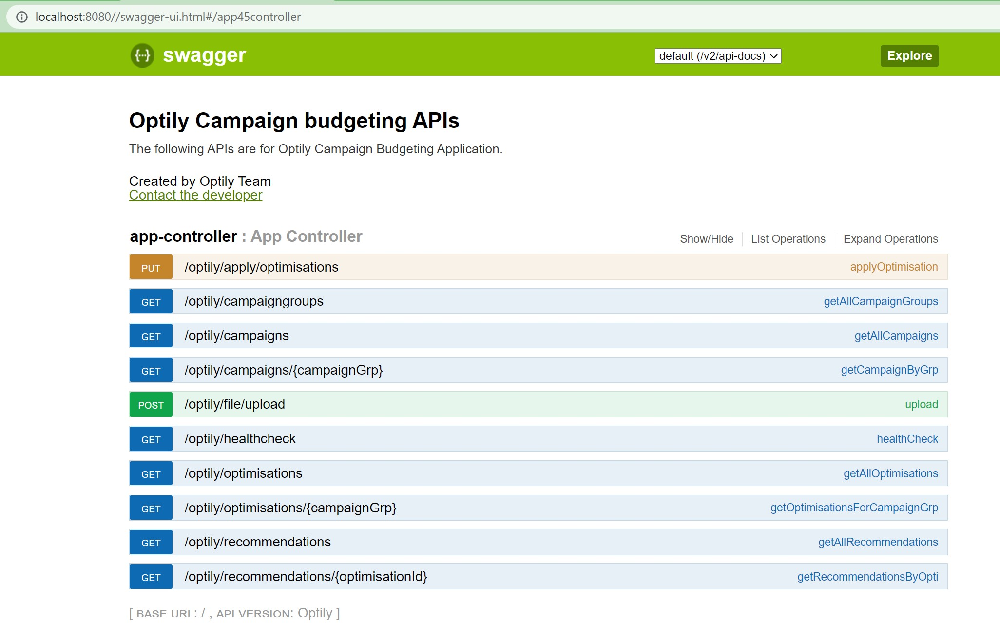
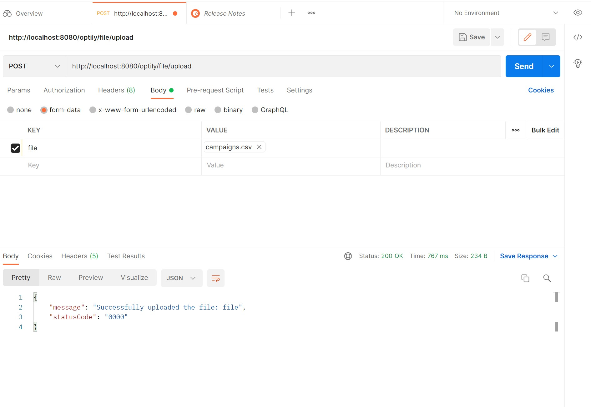
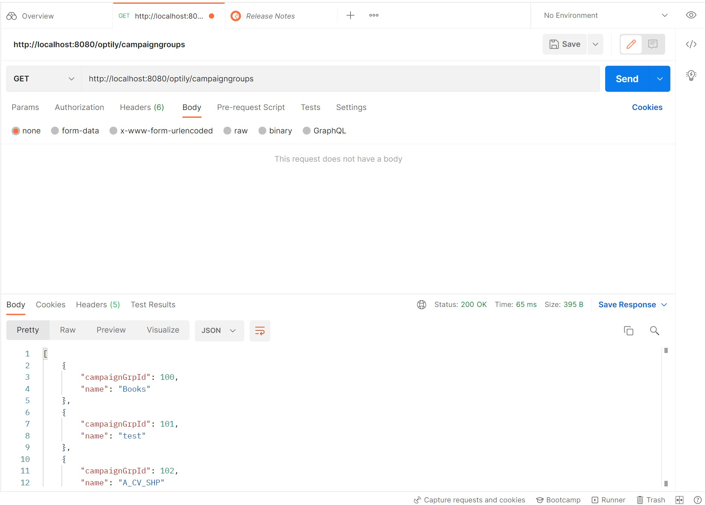
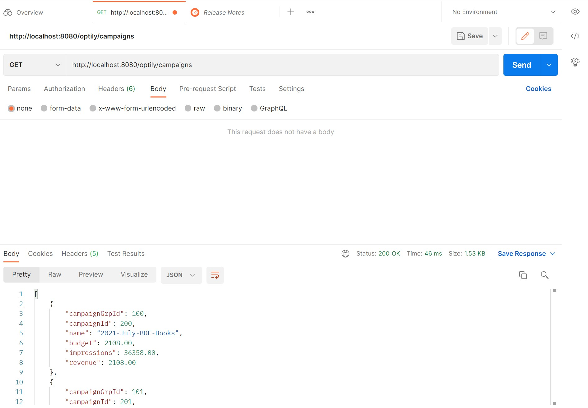
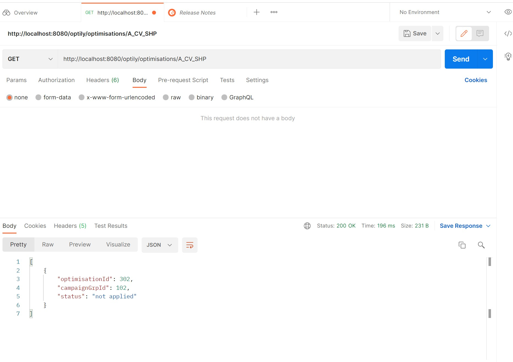
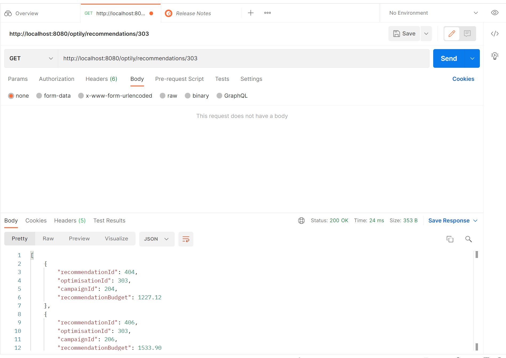
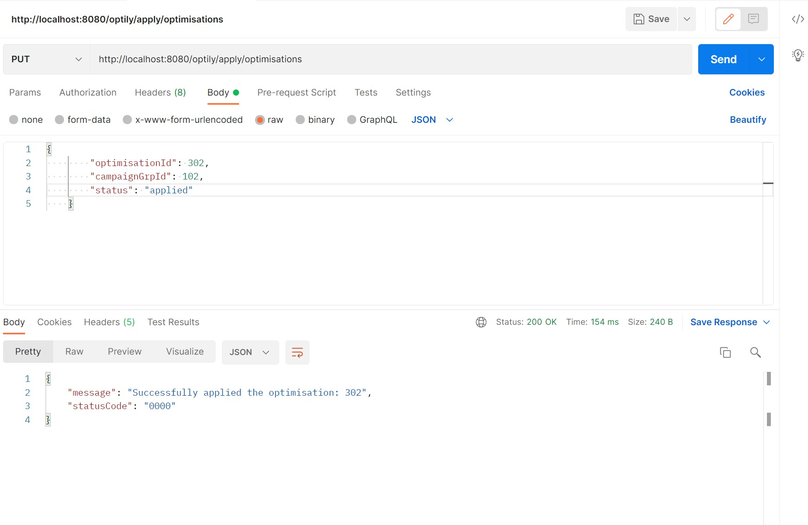
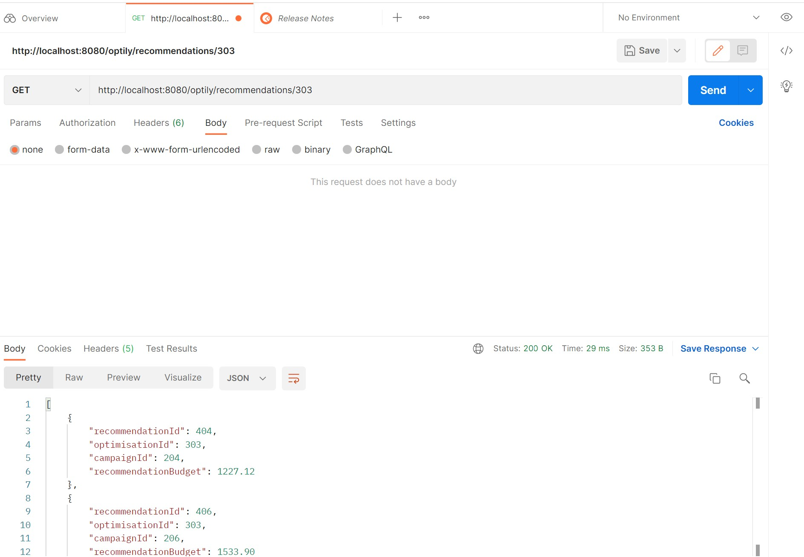

<div id="top"></div>

[![LinkedIn][linkedin-shield]][linkedin-url]

<div align="center">
  <h3 align="center">Optimal Campaign Budgeting</h3>

  <p align="center">
     Optimising the performance of campaigns would be to allocate budgets according to impressions 
  </p>
</div>


<!-- TABLE OF CONTENTS -->
<details>
  <summary>Table of Contents</summary>
  <ol>
    <li>
      <a href="#about-the-project">About The Project</a>
      <ul>
        <li><a href="#built-with">Built With</a></li>
      </ul>
    </li>
    <li>
      <a href="#getting-started">Getting Started</a>
      <ul>
        <li><a href="#usage">Usage</a></li>
      </ul>
  </ol>
</details>


<!-- ABOUT THE PROJECT -->
## About The Project

What we would like you to do is implement a system that takes a group of campaigns,
associated within a campaign group, and performs an optimisation on them based on some
criteria - for example:

A group of 5 campaigns each have a budget of €20 per week.
* Campaign 1 budget: 20
* Campaign 2 budget: 20
* Campaign 3 budget: 20
* Campaign 4 budget: 20
* Campaign 5 budget: 20

The impressions per campaign are as follows:

* Campaign 1 impressions: 100
* Campaign 2 impressions: 200
* Campaign 3 impressions: 400
* Campaign 4 impressions: 200
* Campaign 5 impressions: 100

One approach to optimising the performance of campaigns would be to allocate budgets
according to impressions, where impressions are seen as an indication of a campaign’s
success.
So then with impressions as the criteria of success, then budgets are distributed according to
which campaigns perform better.
So, for example, the recommended budget allocation based on the impressions would be as
follows:

```sh 
Budgets[x] = (Impressions[x] / sum(impressions)) * sum(budgets)
```

So the new budget allocations based on the recommendations made by the optimisation system
would be as follows:

* Campaign 1 budget: 10
* Campaign 2 budget: 20
* Campaign 3 budget: 40
* Campaign 4 budget: 20
* Campaign 5 budget: 10


<p align="right">(<a href="#top">back to top</a>)</p>


### Built With

This section lists out all the required Technologies & Frameworks used to build the project.

* Java 17
* Sprint Boot 2.5.6
* H2 Database (In-memory )
* Maven
* RESTFul Web services 
* Swagger 2
* Junits
* Postman
* JAVA IDE (Eclipse)


<p align="right">(<a href="#top">back to top</a>)</p>


<!-- GETTING STARTED -->
## Getting Started

You can run the application by running runMe.bat on Windows. However, you can modify it to .sh accordingly to run the same. 

But before running please follow the below steps:

```sh
* Create a file localH2.mv in C:/Users/{username} folder 
* Copy h2-1.4.200.jar to C:/Optily/bin
* Copy OptimalBudgeting-0.0.1-SNAPSHOT.jar to C:/Optily/bin
```

Once the above steps are complete, you are good to run runMe.bat file. The file will do the following:

* runMe.bat file will start the H2 database and OptimalBudgeting Project
* It opens up 2 windows in your default browser.
	1. H2 database connection

	


	2. Swagger entry point, listing all the available APIs.

	

* Before connecting to H2 database, Please make sure to enter the JDBC URL correctly as below
	* jdbc:h2:~/localH2
	* please keep the rest as it is and Connect. 

	


* Once connected, you will have create a default Schema "Optily" as below:

	```sh 
	Create Schema Optily
	```

* Great, You are now ready to use the application. 

### USAGE

This section will help you understand how to use the list of provided APIs 

1. /optily/file/upload

is a POST request takes a multiPartfile as an input, with Name, Budget and Impression details in CSV format.

```sh
http://localhost:8080/optily/file/upload
```



2. /optily/campaigngroups

is a GET request that returns list of campaigngroups in a JSON format.

```sh
http://localhost:8080/optily/campaigngroups
```



3. /optily/campaigns

is a GET request that returns list of campaigns in a JSON format.

```sh
http://localhost:8080/optily/campaigns
```




4. /optily/campaigns/{campaignGrp}

is a GET request that takes campaignGrp as an input and returns list of campaigns belonging at a {campaignGrp in a JSON format.

```sh
http://localhost:8080/optily/campaigns/A_CV_SHP
```


5. /optily/optimisations/{campaignGrp}

is a GET request that takes campaignGrp as an input and returns list of optimisations belonging at a {campaignGrp} in a JSON format.

```sh
http://localhost:8080/optily/optimisations/A_CV_SHP
```



6. /optily/recommendations/{optimisationId}

is a GET request that takes optimisationId as an input and returns list of recommendations belonging at a {optimisationId} in a JSON format.

```sh
http://localhost:8080/optily/recommendations/303
```



7. /optily/apply/optimisations

is a PUT request that takes optimisation Json as an input and returns an Response if the optimisation is applied successfully or not in a JSON format.

```sh
http://localhost:8080/optily/apply/optimisations
```



```sh
All the applied optimisations are deleted from Recommendations and will not be shown up.
```




[linkedin-shield]: https://img.shields.io/badge/-LinkedIn-black.svg?style=for-the-badge&logo=linkedin&colorB=555
[linkedin-url]: https://www.linkedin.com/in/nyamath/
